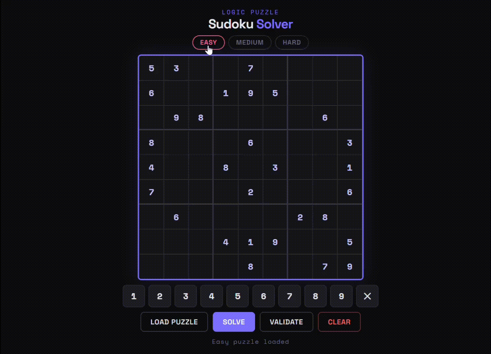

<div align="center">

# 🧩 Sudoku Solver

**A zero-dependency, single-file Sudoku solver built with pure HTML, CSS & JavaScript.**  
Instant solve via backtracking algorithm · Keyboard navigation · Fully responsive · No build step.

[](https://manishkrmahato.github.io/sudoku)
[](LICENSE)
[]()

</div>

---

## Demo



---

## Features

- **Instant solver** - backtracking algorithm solves any valid puzzle in milliseconds
- **3 built-in puzzles** - Easy, Medium, and Hard difficulties to get started immediately
- **Manual entry** - fill in your own puzzle from a newspaper, app, or anywhere
- **Conflict detection** - validate the board and highlights conflicting cells in red
- **Keyboard-first UX** - arrow keys navigate cells, digits fill them, Backspace erases
- **On-screen numpad** - full touch support for mobile users
- **Smart highlighting** - selecting a cell highlights its row, column, and 3×3 box
- **Animated solve** - filled cells pop in with a staggered reveal animation
- **No scroll design** - entire UI fits within one viewport, no scrolling required
- **Zero dependencies** - single `index.html` file, no npm, no bundler, no framework

---

## How It Works

The solver uses a **recursive backtracking algorithm**:

1. Scan the grid left-to-right, top-to-bottom for the first empty cell
2. Try placing digits 1-9, checking row, column, and 3×3 box constraints
3. Recurse into the next empty cell
4. If no digit fits, backtrack and try the next candidate in the previous cell
5. Repeat until the board is fully filled or declared unsolvable

```
isValid(board, row, col, num)
  -> check row   : no duplicate in board[row][0..8]
  -> check col   : no duplicate in board[0..8][col]
  -> check box   : no duplicate in the 3×3 region
```

Time complexity: **O(9^m)** where m = number of empty cells - optimized by early pruning at each step.

---

## Getting Started

No install. No build. Just open it.

```bash
git clone https://github.com/manishkrmahato/sudoku.git
cd sudoku
open index.html   # or double-click in your file explorer
```

Or visit the **[Live Demo](https://manishkrmahato.github.io/sudoku)** directly.

---

## Usage

| Action | How |
|---|---|
| Select a cell | Click it |
| Enter a digit | Type `1`-`9` or use the on-screen numpad |
| Erase a cell | `Backspace` / `Delete` / `0` or the ✕ button |
| Navigate | Arrow keys |
| Load a puzzle | Pick a difficulty → click **Load Puzzle** |
| Solve | Click **Solve** |
| Check for errors | Click **Validate** |
| Start fresh | Click **Clear** |

---

## Project Structure

```
sudoku/
└── index.html      # Everything - layout, styles, and logic in one file
└── demo.gif        # Demo recording for README
└── README.md
```

---

## Lighthouse Score

| Metric | Score |
|---|---|
| Performance |  100 |
| Accessibility |  100 |
| Best Practices |  100 |
| SEO |  100 |

---

## Author

**Manish Kumar Mahato**  
B.Tech CSE · NIT Warangal  
[GitHub](https://github.com/manishkrmahato) · [LeetCode](https://leetcode.com/manishkrmahato)

---

<div align="center">
  <sub>Built with pure HTML, CSS & JavaScript · No frameworks · No dependencies</sub>
</div>
